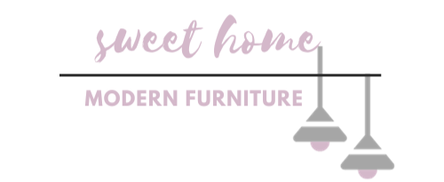

# Furniture E-Commerce 🛋️

 
A modern <h2> landing page for an e-commerce furniture website .</h2>

📌 [Live Demo](https://ghaliah1.github.io/furniture-E-commerce/)  

 
<h2> Features:</h2>
 
- Smooth scrolling between sections   
- Navigation bar for quick access   
- Sections: services, products, contact, and reviews   
- "Back to top" arrow for easy navigation   

<h2> More information:</h2>
This project focuses on creating a smooth and modern browsing experience for an e-commerce landing page.  

⚠️ Note: The **Add to Bag**, **Add to Favorites**, and **Search** buttons are placeholders (not functional yet).   

<h2> echnologies Used</h2>
- HTML   
- CSS / SCSS / Less   
- JavaScript   
